# アルゴリズム

本ドキュメントではマルチモーダルLLMを用いたドキュメントのパースについて記述する。



## ページ毎にテキストを抽出する

PDFパーサーで抽出したテキストや画像、図表をページ毎にマルチモーダルLLMに入力する。

## ドキュメント種別の判別

ドキュメントのプロパティを取得し、テキストのみの場合は次のページの処理に進む。
判別に関しては画像を圧縮したうえで、マルチモーダルLLMによる判別を行う。
各プロパティに即したプロンプトを生成し、マルチモーダルLLMに入力する。

- 日本語テキスト
- グラフ
- テーブル
- 画像

プロンプトは以下に従う。

```text
Analyze the input image and classify its content according to the following properties.

- **table**: Select if the image contains a table, such as a grid or matrix displaying structured data.
- **flowchart**: Select if the image contains a flowchart or diagram illustrating a process or sequence of steps.
- **graph**: Select if the image contains a graph, chart, or plot.
- **image**: Select if the image contains any other image except for tables and graphs.
- **ja_text**: Select if the image contains any Japanese text, even if other elements are also present.
- **text**: Select if the image contains any text, even if other elements are also present.

# Steps

1. Analyze the input image to identify all content types present.
2. For each property(**table**, **flowchart**, **graph**, **image**, **ja_text**, **text**), select all that apply.
```

## コンテキストとメタ情報

ドキュメントのメタ情報と前ページまでのコンテキストを取得し、マルチモーダルLLMに入力する。
コンテキストはページを読み進めるごとに更新する。

```text
Based on the provided context and new information, update the context to include relevant information.

# Constraints
- List any requirements, prerequisites, or action items extracted from new information, as they may be necessary for further pages.
- New information is provided by user input.
- Maintain the context with 5-7 bullet points.

# Context

{context}
```

## ページのテキスト抽出

コンテキスト情報とページをラフに読み取ったテキストをマルチモーダルLLMに入力する。

```text
You are an expert in reading documents from images.
Please write out the content accurately, staying faithful to the given image content.

# Constraints
- User will input the sentence. Please modify the sentence to make it more accurate.
- Don't hallucinate the content that doesn't exist in the image.
- Document context is provided for reference.
- Transcribe accurately, staying true to the image content and language.

# Document Type

## Text Information
- Please describe the all texts in this documents.

{document_type_prompt} // ドキュメントの種別に応じたプロンプト

# Document Context

{context}
```

## References

### マルチモーダルLLM

- [マルチモーダルLLMとは](https://www.youtube.com/watch?v=nKma3gafkUI)
- [マルチモーダルLLMのプロンプト](https://cloud.google.com/vertex-ai/generative-ai/docs/multimodal/design-multimodal-prompts?hl=ja)
- [マルチモーダルLLMのプロンプトサーベイ](https://arxiv.org/pdf/2409.19339)

### PDFのテキスト抽出

- [PDFのテキスト抽出(非ページ単位)](https://arxiv.org/pdf/2410.05970)
- [PDFのページ読み込み](https://arxiv.org/pdf/2408.11981)
