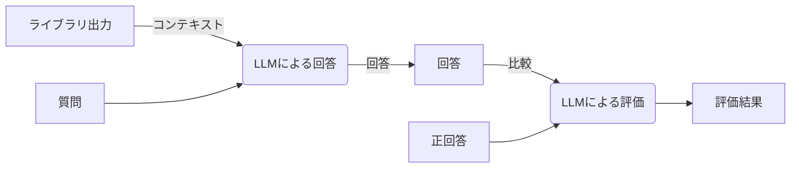

# 評価方法

[評価レポジトリ](https://github.com/InsightEdgeJP/parse-docs-eval)により、以下の方法で評価を行います。

0. API利用量を削減するために各種処理はローカルストレイジにキャッシュします。
1. ライブラリの出力をコンテキストとして、評価データセットの質問を投げます。
2. 回答を取得し、正回答と比較し、正当かどうかを100点満点で判定します。



`LLMによる回答` は、以下のプロンプトで回答します。

```text
You are a helpful assistant.
Please respond to the query using the provided Context.
If the query contains information not included in the Context, reply with "I don’t know".

## Output
Please follow the JSON format below for the output.

"answer": str

## Context
{context}
```

`LLMによる評価` は、以下のプロンプトで判定します。

```text
You are an excellent evaluator.
Please grade the user’s responses to the following questions on a scale of 0 to 100 points.
Provide only the score.

## Output
Please follow the JSON format below for the output.

"rank": int

## Query
{query}

## Expected:
{expected}
```

## ベンチマーク対象

以下をベンチマーク対象とします。

- [Azure Document Intelligence](https://learn.microsoft.com/ja-jp/azure/ai-services/document-intelligence/overview?view=doc-intel-4.0.0)
- [pymupdf4llm](https://github.com/pymupdf/RAG/tree/main)
- [docling](https://github.com/DS4SD/docling/tree/main)
