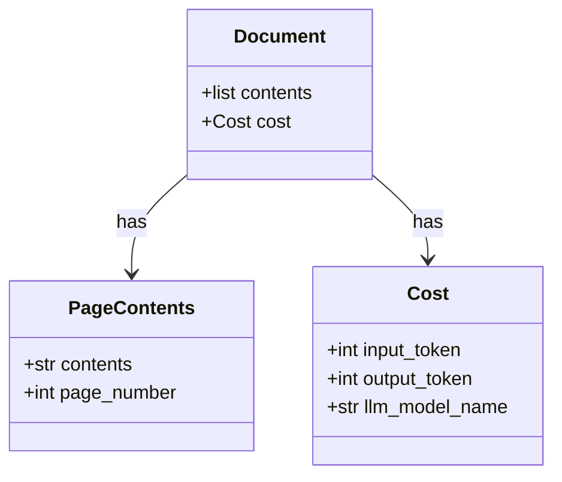

# Parse Doc Library


本ライブラリは、画像を含むドキュメントのパースを行うためのライブラリです。
テキストとして出力することで、従来のベクトル検索や全文検索での利用を可能することを目的とします。

## 📝 ドキュメントのパース

### Background

- 多くのドキュメントには、グラフや画像のような非テキストが含まれる
- これらのドキュメントをRAGのような検索システムに組み込むためには、テキストドメインに変更する必要がある(画像やテキストを同一のベクトルにする技術はまだ有効ではない)
- MLLMの進展に伴い実装が容易化したものの、まだ各案件で真剣に取り組みには工数がかかる部分ではある

### Goal

1. ドキュメントの全文抽出を行うツールを提供
2. ツールの評価を行い、継続的に改善するためのCI/CDを構築
3. ツールを簡単に導入できるように構築
4. 実行時のAPIコストの算出


## 📑 対応ファイル

| コンテンツタイプ | 拡張子 |
|-----------------|--------|
| **📑 ドキュメント**  | PDF, PowerPoint |
| **🖼️ 画像**        | JPEG, PNG, BMP |
| **📝 テキストデータ** | テキストファイル, Markdown |
| **📊 表データ**     | Excel, CSV |

## 🔥 LLM

|クラウドベンダー|モデル|
|-|-|
|Azure|GPT|
|Google Cloud|Claude, Gemini|

## 📥 インストール方法

### LibreOffice

Officeファイルをテキストに変換するために、LibreOfficeをインストールします。

```bash
# Ubuntu
sudo apt install libreoffice

# Mac
brew install --cask libreoffice
```

### ライブラリのインストール

```bash
pip install exparso
```

## 💡 使用方法

`parse_document` 関数を利用して、ドキュメントをパースします。

```python
from exparso import parse_document

# For AzureChatOpenAI
from langchain_openai import AzureChatOpenAI
import getpass
import os
if "AZURE_OPENAI_API_KEY" not in os.environ:
    os.environ["AZURE_OPENAI_API_KEY"] = getpass.getpass(
        "Enter your AzureOpenAI API key: "
    )
os.environ["AZURE_OPENAI_ENDPOINT"] = "https://YOUR-ENDPOINT.openai.azure.com/"
llm_model = AzureChatOpenAI(model="gpt-4o")

# For GoogleChatOpenAI
import vertexai
from langchain_google_vertexai import ChatVertexAI
vertexai.init(project="YOUR_PROJECT", location="us-central1") # Default の認証情報を利用
llm = ChatVertexAI(model_name="gemini-1.5-pro-002")

text = parse_document(
      path="path/to/document.pdf",
      model=llm_model,
      context="このドキュメントは..."
)
```

`model`は`LangChain`の`BaseChatModel`を継承したクラスで、各LLMベンダーに合わせて、認証情報を設定してください。

- [AzureChatOpenAI](https://python.langchain.com/docs/integrations/chat/azure_chat_openai/)
- [ChatVertexAI](https://python.langchain.com/docs/integrations/chat/google_vertex_ai_palm/)

#### プロンプトのカスタマイズ

[プロンプトのカスタマイズ](prompts.md)を参照ください。

### アウトプット

`Document`クラスのインスタンスが返されます。`Document`のプロパティは以下になります。


